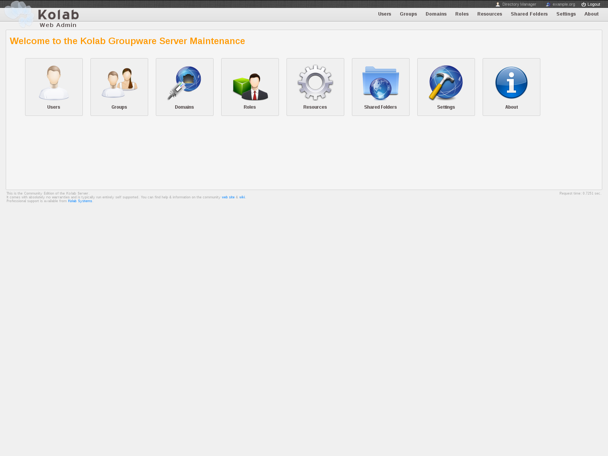
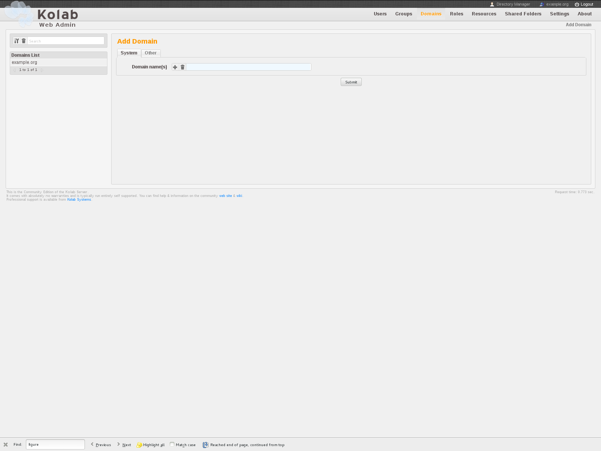

========================================
Using the Kolab Web Administration Panel
========================================

The :ref:`figure-overview` lists object types the user that is logged in is
eligible to list.

This list can include:

*   Users

        This part of the interface allows an administrator to add new users
        and edit, list and search existing users. This may include Kolab users,
        but also POSIX users, or even contacts.

*   Groups
*   Domains
*   Roles
*   Resources
*   Shared Folders
*   Settings

The **About** link is always there.

The Kolab Web Administration Panel and its API
==============================================

The Kolab Web Administration Panel by default uses the
:envvar:`$_SERVER["HTTP_HOST"]` PHP variable to find its way back to its API.

If you use your desktop browser to navigate to http://admin.example.org/, the
Web Administration Panel will seek to address its API using
http://admin.example.org/api/.

``admin.example.org`` should thus resolve to the correct IP address, from the
perspective of the Web Administration Panel server.

.. _figure-overview:

    Overview page of the Kolab Web Administration Panel

Users Administration
====================

Groups Administration
=====================

Domains Administration
======================

The **Domains** page of the Kolab Web Administration Panel lists, on the
left-hand side, :term:`parent domain name spaces`.

.. _figure-list_domains:

    The Domains