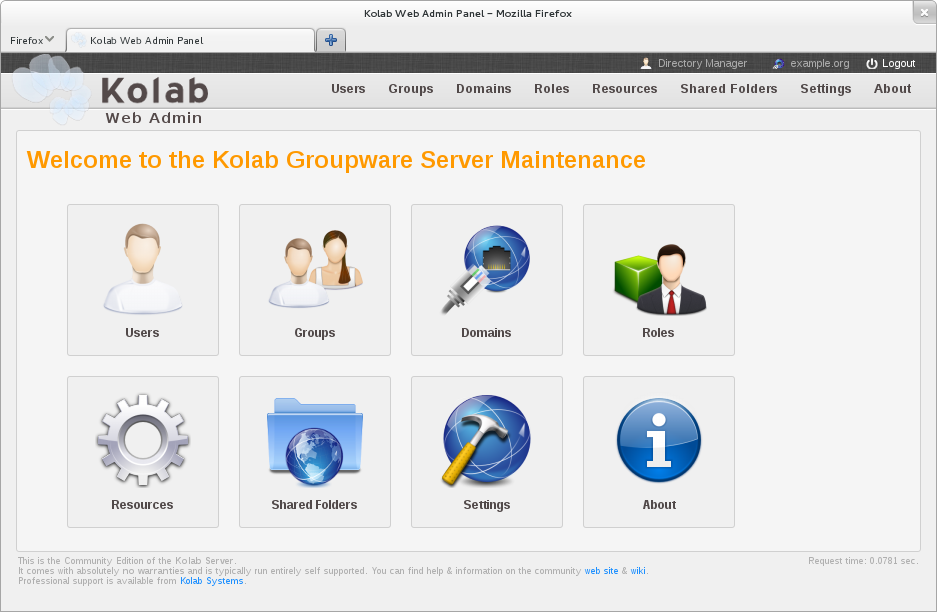

.. _admin-webadmin:

========================================
Using the Kolab Web Administration Panel
========================================

The :ref:`figure-overview` lists object types the user that is logged in is
eligible to list -- that is, the user has at least read and search access on the
container of the type of object.

For example, a user may have access to ``ou=People`` (the container for
*Users*), but not ``cn=kolab,cn=config`` (for *Domains*).

In such a case, the user would have a *Users* page to navigate to, but not a
*Domains* page.

This list can include:

*   Users

        This part of the interface allows an administrator to add new users
        and edit, list and search existing users. This may include Kolab users,
        but also POSIX users, or even contacts.

*   Groups

        Groups are used for message distribution (called *distribution groups*),
        can be used as POSIX groups, and could be used to assign permissions in
        LDAP.

        By default, group membership is not used to share information in IMAP
        such as calendars or other payload. The default configuration uses roles
        for IMAP group ACLs instead.

*   Domains

        This section allows you to control what namespaces the server will
        receive email for, as well as whether that namespace is or is not a
        completely separate and isolated organizational hierarchy.

*   Roles

        Roles are used to assign permissions to Kolab users. A role already
        included in your installation is the one used for Kolab administration
        (the **kolab-admin** role).

        Roles can be used as IMAP group ACLs, and adjust, restrict or liberate
        the use of plugins and/or settings in web services such as the Roundcube
        web client, iRony (CardDAV/CalDAV), Syncroton (ActiveSync) and Chwala
        (Files).

*   Resources

*   Shared Folders

        This section allows the administration of shared folders, 

*   Settings

The **About** link is always there.

The Kolab Web Administration Panel and its API
==============================================

The Kolab Web Administration Panel by default uses the
:envvar:`$_SERVER["HTTP_HOST"]` PHP variable to find its way back to its API.

If you use your desktop browser to navigate to http://admin.example.org/, the
Web Administration Panel will seek to address its API using
http://admin.example.org/api/.

``admin.example.org`` should thus resolve to the correct IP address, from the
perspective of the Web Administration Panel server.

.. _figure-overview:

    Overview page of the Kolab Web Administration Panel

Users Administration
====================

Groups Administration
=====================

Domains Administration
======================

The **Domains** page of the Kolab Web Administration Panel lists, on the
left-hand side, :term:`parent domain name spaces`.

.. _figure-list_domains:

.. figure:: images/list-domains.png
    :scale: 50%

    The Domains
