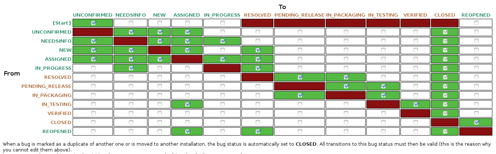

========
Bugzilla
========

Our `bugzilla`_ is our primary tracker for tickets that involve our
development, release, planning, and project- and product-management
processes.

This document describes how you should consider working with Bugzilla.

Bugzilla Status
===============

The following is a description of each state used in Bugzilla, just to
clarify any ambiguity in the terminology used, and to make sure everyone
is up-to-date on the expectations created from a certain ticket being in
a certain status, and what is expected before it moves on to the next
status.

.. _bugzilla-status-unconfirmed:

UNCONFIRMED
-----------

A ticket starts in status UNCONFIRMED to indicate it has not yet been
"triaged" -- see :ref:`bugzilla-triaging-bugzilla-tickets`.

In our Bugzilla, the assignee at this point may be devel@lists.kolab.org
(as in: *"Nobody's working on this"*), or the assignee may be one
particular person or multiple people that is/are deemed suitable for
triaging.

In this status, a person looking at the ticket should confirm that;

*   The product and product component against which the ticket is
    created is accurate, including the platform and operating system
    field(s).

*   The version of Kolab Groupware or the version of the Kolab Groupware
    software component is indeed accurate, and still supported.

*   The targeted version for the ticket to be resolved in is
    appropriate, in that we tend to not work backwards.

    As a rule of thumb, everything is first implemented and/or resolved
    in the future version of software, and only considered for
    backporting afterwards.

*   The necessary information needed to resolve the ticket is available,
    such as;

    For tickets of type *bug*:

    *   issue symptoms,

    *   related software versions,

    *   platform, and platform version,

    *   configuration of the software, and the environment (including
        the type of deployment architecture),

    *   and other information that allow the next person to receive the
        ticket to reproduce the original issue.

    For tickets of type *enhancement*:

    *   A genuine, accurate, unambiguous description of the requested
        functionality is supplied, i.e. NOT "wish I could do $x".

When the necessary information is provided, the ticket can move forward
to status :ref:`bugzilla-status-new`.

When a ticket is not yet complete, it may be set to
:ref:`bugzilla-status-needsinfo`.

In rare circumstances, an UNCONFIRMED ticket may be directly moved to
status CLOSED -- usually along with a resolution of WONTFIX, DEFERRED or
NOTABUG.

.. _bugzilla-status-new:

NEW
---

A ticket in status NEW is waiting to be assigned to a developer, and may
as such be taken on by a product manager instead.

This status is a placeholder for all inbound tickets; bugs, tasks and
enhancements alike. At this stage, the ticket is deemed sufficiently
detailed and feasible to result in resolution.

Before the ticket is assigned to an actual developer, the following
items need to be verified;

*   The :ref:`bugzilla-priority-and-severity` of the ticket,

*   The appropriate :ref:`bugzilla-assignee` for the ticket,

and possibly also (for product management and/or project management);

*   An estimation of the :ref:`bugzilla-effort-involved`,

*   The target milestone, or target milestones for all products and
    product components involved,

*   Any ticket(s) to which the ticket is related (see:
    :ref:`bugzilla-see-also`), or in to which the request splits out
    (see
    :ref:`bugzilla-example-cyrus-imapd-sieve-date-extension-support`).

.. _bugzilla-status-assigned:

ASSIGNED
--------

The ticket has been assigned, hopefully by someone sufficiently
knowledgeable and otherwise someone eligible to allocate community
and/or corporate resources to the resolution of the ticket.

When a ticket is assigned, all its dependencies should be in order, and
the assignee may find the ticket blocking other tickets.

It is now up to the assignee to;

*   Verify the ticket, so that it is understood;

    *   The target milestone indicated in the ticket is the version of
        the software to which the resolution should apply,

    *   The issue resolution should first be created for and applied to
        the latest and greatest (i.e. "next") version of the software,

    *   The issue's resolution can indeed be backported to the targeted
        branch of software. See
        :ref:`bugzilla-requirements-for-backporting`.

    Should the former conditions or validation steps not be complete,
    such as when an issue's resolution can be created for and applied to
    the "next" version of the software, but not the "current stable"
    version thereof, then it is the developer's responsibility to
    contact product management.

*   Start work on the ticket (and change the status to
    :ref:`bugzilla-status-in_progress`). This will indicate acceptance
    of the ticket.

.. _bugzilla-status-in_progress:

IN_PROGRESS
-----------

While a ticket is in status IN_PROGRESS, a developer is actually working
on the ticket.

While in this status ticket's assignee field **MUST** be set to the
physical human being performing the work.

A developer will ultimately have a patch or result of labour to be
committed and pushed out some place.

When the work is completed, and the issue's resolution has been made
available, the status of the ticket is to be moved to
:ref:`bugzilla-status-resolved`.

.. _bugzilla-status-resolved:

RESOLVED
--------

The RESOLVED status indicates that a commit has been made and pushed,
that is believed to resolve the issue (i.e. "fix the bug" or "implement
the enhancement").

It is the developer's responsibility to set a ticket to status RESOLVED.

Release engineering and project management are now responsible for the
ticket, however the assignee **SHOULD NOT** be changed from this point
on forward.

An extra ticket should be created for each target milestone in which the
resolution to this ticket is to be included (by creating a clone of this
ticket).

As the next status for the ticket could be either of the two following:

*   :ref:`bugzilla-status-pending_release`, which tends to be the status
    used to indicate the availability of the resolution can wait until
    the software is properly released,

*   :ref:`bugzilla-status-in_packaging`, which tends to indicate the
    resolution is packaged in the form of a patch or even a source code
    management repository snapshot.

.. _bugzilla-status-pending_release:

PENDING_RELEASE
---------------

A ticket set to PENDING_RELEASE is awaiting the upstream release of a
versioned piece of the software that includes the resolution to this
ticket.

When a ticket is changed to PENDING_RELEASE it is apparent the
availability of the ticket's resolution can wait for the upstream
release of the next version of the software.

When a ticket is changed to IN_PACKAGING it is implicitly requesting;

*   the ticket's resolution is included in to the packaging as a patch
    on top of the current -- otherwise stable -- release(d package).

*   a new release is created to subsequently result in a new package --
    this includes snapshot releases.

Tickets that move from PENDING_RELEASE (on to the next status
IN_PACKAGING) imply that a variety of other aspects of our Bugzilla have
also been updated, including versions, milestones and
**Fixed in Version** fields.

.. _bugzilla-status-in_packaging:

IN_PACKAGING
------------

Somebody is to package the ticket's resolution.

After the status IN_PACKAGING is completed, the ticket is to move in to
IN_TESTING, provided the details about which product stream the new
package has been made available in (i.e. target platform, product
version, edition, repository stage, package NEVRA).

Before a ticket can be moved to IN_TESTING, a draft errata should be
made available, especially where additional instructions are to be
included (to facilitate upgrades, and/or new configuration items).

.. _bugzilla-status-in_testing:

IN_TESTING
----------

Tickets in testing are pending verification by Quality Assurance.

.. _bugzilla-status-verified:

VERIFIED
--------

Quality Assurance has successfully verified the upgrade path to the new
software as well as the issue's resolution.

This opens up the path for release engineering and/or product management
to release the update as stable.

.. _bugzilla-status-closed:

CLOSED
------

The ticket has been resolved, and all subsequent tasks have been
completed.

.. _bugzilla-status-needsinfo:

NEEDSINFO
---------

Status Workflow
---------------

You need administrative privileges to view the actual configuration of
the status workflow in Bugzilla, but we can provide you with a
screenshot (Sunday, August 3rd, 2014):

.. NOTE::

    All statuses that are in red are considered closed tickets. All
    statuses in green are considered open tickets.

Here is a more dynamic diagram:

.. graphviz::

    digraph {
            "UNCONFIRMED" [color=green];
            "NEW" [color=green];
            "ASSIGNED" [color=green];
            "IN_PROGRESS" [color=green];
            "NEEDSINFO" [color=green];
            "RESOLVED" [color=red];
            "PENDING_RELEASE" [color=red];
            "IN_PACKAGING" [color=red];
            "IN_TESTING" [color=red];
            "VERIFIED" [color=red];
            "CLOSED" [color=red];
            "REOPENED" [color=green];

            "UNCONFIRMED" -> "NEW" [label="(1)"];
            "UNCONFIRMED" -> "NEEDSINFO" [label="(18)"];

            "NEW" -> "ASSIGNED" [label="(2)"];
            "NEW" -> "NEEDSINFO" [label="(18)"];

            "ASSIGNED" -> "NEW" [label="(3)"];
            "ASSIGNED" -> "IN_PROGRESS" [label="(4)"];
            "ASSIGNED" -> "NEEDSINFO" [label="(18)"];
            "IN_PROGRESS" -> "NEEDSINFO" [label="(18)"];

            "IN_PROGRESS" -> "RESOLVED" [label="(5)"];

            "RESOLVED" -> "PENDING_RELEASE" [label="(6)"];
            "RESOLVED" -> "IN_PACKAGING" [label="(7)"];

            "IN_PACKAGING" -> "PENDING_RELEASE" [label="(8)"];
            "IN_PACKAGING" -> "IN_TESTING" [label="(9)"];

            "PENDING_RELEASE" -> "IN_PACKAGING" [label="(10)"];
            "PENDING_RELEASE" -> "IN_TESTING" [label="(11)"];

            "IN_TESTING" -> "ASSIGNED" [label="(12)"];
            "IN_TESTING" -> "VERIFIED" [label="(13)"];

            "VERIFIED" -> "CLOSED" [label="(14)"];

            "CLOSED" -> "REOPENED" [label="(15)"];

            "REOPENED" -> "ASSIGNED" [label="(16)"];
            "REOPENED" -> "RESOLVED" [label="(17)"];
        }

Workflow Steps
^^^^^^^^^^^^^^

This section is a placeholder to document the individual steps outlined
in the forementioned diagram.

.. _bugzilla-triaging-bugzilla-tickets:

Triaging Bugzilla Tickets
=========================

Assigning a Bugzilla Ticket
===========================

.. _bugzilla-assignee:

Assignee
--------

The assignee of a ticket is the person or the group of persons
responsible for the ticket.

A single person being the assignee of a ticket does not mean that ticket
also has to be resolved by that person (unless the ticket has status
IN_PROGRESS). It is, however, the assignee's responsibility to "bounce"
a ticket.

A group of persons being the assignee(s), such as devel@lists.kolab.org,
puts the responsibility on to no one person in particular. Tickets with
these assignees tend to linger for a long time, as nobody in particular
feels responsible for it.

.. _bugzilla-cc-list:

CC List
-------

The CC list of a ticket is a list of people generally interested in its
progress.

.. _bugzilla-qa-contact:

QA Contact
----------

The QA contact of a ticket is the person or group of persons to contact
when the assignee wants to verify and/or coordinate how the validation
of the ticket's resolution is to be performed.

.. _bugzilla-see-also:

See Also
========

The **See Also** field can be used to refer to external Bugzilla
entries, such as those on the `KDE Bugzilla` or `Cyrus IMAP Bugzilla`.

.. _bugzilla-priority-and-severity:

Priority & Severity
===================

The priority field in a Bugzilla ticket establishes (between tickets)
the order in which tickets should be worked on (highest priority first).

As a rule of thumb, tickets that qualify for a higher priority are:

*   Blocking a number of other tickets,

*   Have gone unanswered and/or unresolved for too long,

*   Potentially have great impact, such as security issues and/or actual
    loss of data,

*   Generally need to be resolved sooner rather than later.

.. _bugzilla-effort-involved:

Effort Involved
===============

.. _bugzilla-example-cyrus-imapd-sieve-date-extension-support:

Example Ticket: Sieve Date Extension Support for Cyrus IMAP
===========================================================

The Sieve Date extension is targeted to be used as a means to clause
vacation actions to be applied during a window of time in the future.

For example, a user could configure to be on holiday next week (today is
Sunday, August 3rd, 2014):

.. parsed-literal:

    if allof(
            currentdate :is "year" "2014",
            currentdate :is "month" "08",
            currentdate :value "ge" "day" "04",
            currentdate :value "lt" "day" "08"
        ) {
            vacation [parameters];
    }

This is a coordinated effort between the following products:

#.  Cyrus IMAP
#.  Roundcube
#.  Kontact
#.  PyKolab
#.  Sievelib

An original ticket is created: `#3242`_. This is the generic feature
enhancement request for the Kolab Groupware server as a whole.

It is therefore not assigned to any one particular developer, but to
someone who can track the progress of the full implementation of the
functionality for all components involved.

This assignee is responsible for creating the additional tickets to
each individual component involved, including:

#.  `#3243`_ for Cyrus IMAP

    For the actual implementation of the Sieve Date Extension, Cyrus
    IMAP requires the enhancement first.

#.  `#xxxx`_ for Roundcube

    For the functionality in Cyrus IMAP to be meaningful, Roundcube will
    need to expose the necessary UI components for users.

#.  `#xxxx`_ for Kontact

    For the functionality in Cyrus IMAP to be meaningful, Roundcube will
    need to expose the necessary UI components for users.

#.  `#xxxx`_ for PyKolab

    The availability of the functionality depends on **pykolab** setting
    up Cyrus IMAP correctly (i.e. the setting ``sieve_extensions`` in
    :man:`imapd.conf(5)` needs the new extension name), and using
    sievelib, the Kolab daemon may use settings from LDAP.

#.  `#xxxx`_ for Sievelib

    The Python Sieve management library does not have a module to handle
    the new date extension, and may need amending.

.. _#3242: https://issues.kolab.org/show_bug.cgi?id=3242
.. _#3243: https://issues.kolab.org/show_bug.cgi?id=3243
.. _bugzilla: https://issues.kolab.org
.. _KDE Bugzilla: https://bugs.kde.org
.. _Cyrus IMAP Bugzilla: http://bugzilla.cyrusimap.org
